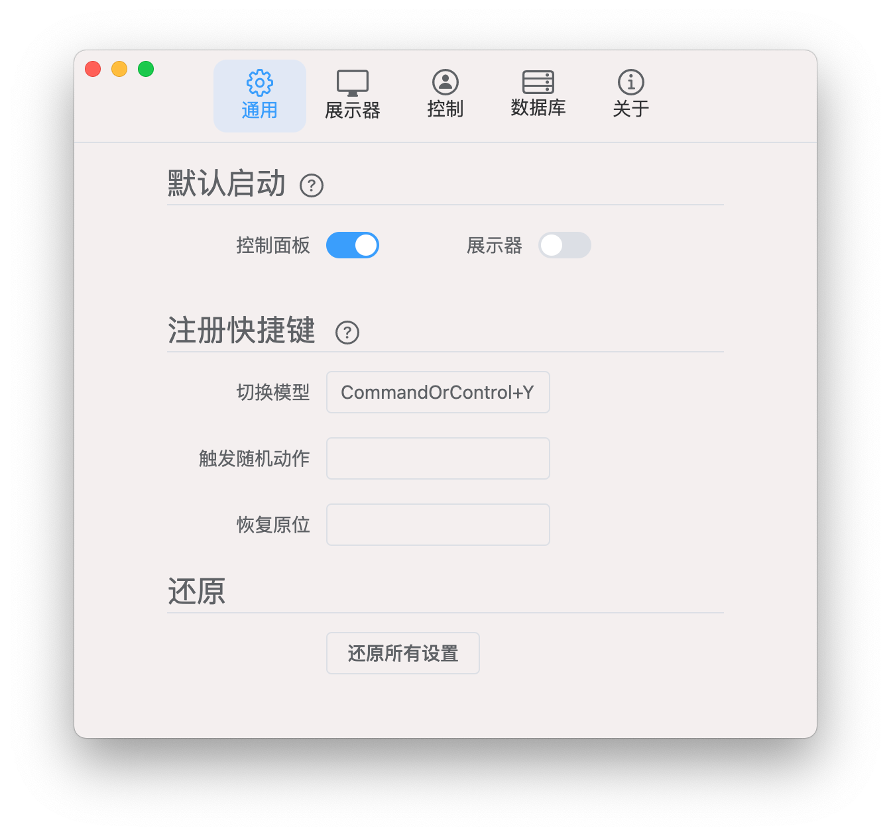
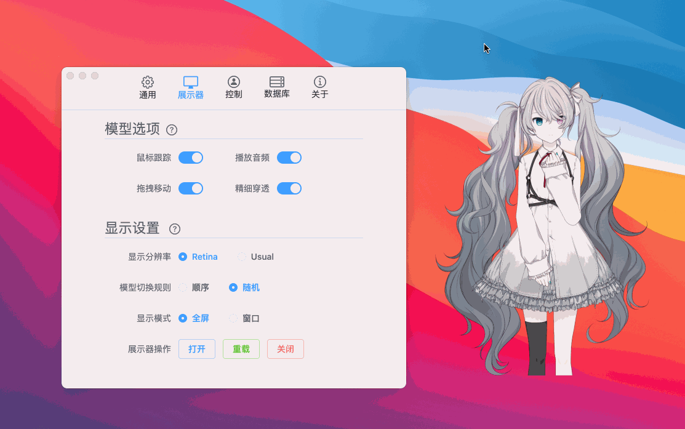
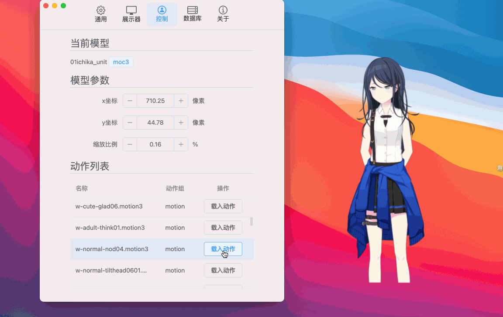
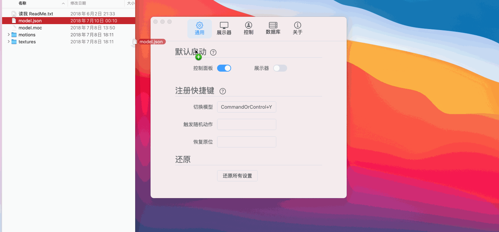

# Hime Display

<p align="center">
  
</p>

> illustrated by MakoSaikou

一个基于 Electron 的 Live2D 桌面展示器，同时支持 moc、moc3 模型。

## 支持平台：

Windows、macOS (Linux 经测试存在一些问题，暂不支持)

## 主要依赖：

- [Electron](https://github.com/electron/electron)
- [Vite](https://github.com/vitejs/vite)
- [Vue3](https://github.com/vuejs/vue)
- [pinia](https://github.com/vuejs/pinia)
- [Element Plus](https://github.com/element-plus/element-plus)
- [pixi-live2d-display](https://github.com/guansss/pixi-live2d-display)

## 开发

```bash
# 安装依赖
yarn install
# 启动
yarn run start
# Server启动模式（分别通过两个终端窗口下方的两条命令，这种方式主要是可以看到主进程的控制台输出）
yarn run serve
eletron .
# 构建（具体build版本可以在根目录下的build.config.js文件中配置）
yarn run build
```

## 预览：

> 图片中所有涉及的模型仅作演示使用，如侵立删

控制面板：



展示器：

（你什么都没看见就对了，因为展示器本身就是一个透明的窗口……）

鼠标跟踪：



载入动作：



点击穿透（在模型非透明部分单击右键触发了本应用的菜单，透明部分右键触发Finder菜单）：


拖拽json打开模型：



## 使用指引：

### 打开模型的方式：

1. 在`控制面板窗口-数据库`设定数据库后，选中模型，点击载入选中模型
2. 直接将模型的入口 json 文件拖到控制面板上（注意是模型入口的 model.json 文件）

### 模型的控制：

在展示器上直接拖动模型可以调整位置，`控制面板窗口-控制`中可以对模型进行更精确的控制，以及播放动作

### 其他：

相信各位打开控制面板摸索一下就知道怎么用了……

目前可能会存在一些奇怪的问题，出现故障可通过重载展示器，重置数据库等方式解决

## 一些特性：

- 支持模型的音频播放
- 支持拖拽 json 打开模型
- 全屏幕的模型视线跟踪鼠标移动
- 配备一个感觉还算完善的控制面板
- 支持 Retina 分辨率的显示，不过有点消耗性能
- 跨桌面显示，macOS 即使处于全屏应用模式也能覆盖在上方
- 像素级精确的模型区域点击穿透，模型周围透明的部分都能直接穿透点击到下方窗口
- 提供一个模型数据库，设定目录后可以自动检测里面的模型，并提供检索，筛选等功能
- 在 macOS 自认为表现的还算原生，起码支持了深色模式，控制面板的设计也是 macOS 的

## 之后考虑可能添加的内容：

- 多语言支持
- 根据模型触发区域响应动作
- 多模型展示

## 目前存在的一些问题：

- 一些质量过高的模型展示可能会出现锯齿
- macOS 上应用的菜单栏的显示状态会有一点怪异
- macOS 上窗口聚焦于控制面板时，模型视线跟踪鼠标失效
- 对 macOS 深色模式的支持是手动搭配的样式，有一些地方还是 不太和谐
- 之前没有相关经验（一个半月前我甚至还完全不会 Vue），自我认为代码写得超级烂……
- macOS 上目前存在未知 bug，若启动应用通过控制面板打开展示器，初次启动时会导致跨桌面显示失效，需要重启展示器
- 经测试应用的能耗似乎有点大，目前实现 live2d 模型显示完全依托于 pixi-live2d-display，我甚至连 WebGL 都还没玩明白，所以也不知道之后能不能进行什么优化

## 关于模型的获取方式：

本项目未直接提供任何模型，下方列出一些模型的获取途径：

GitHub：

- [Eikanya/Live2d-model](https://github.com/Eikanya/Live2d-model)

Gitee：

- [zklcdc/live2d_models](https://gitee.com/zklcdc/live2d_models)
- [xyzgy/live2d-model](https://gitee.com/xyzgy/live2d-model)
- [chenmoxiamu/live2d](https://gitee.com/chenmoxiamu/live2d)
- [rao_she/live2d_models_collect](https://gitee.com/rao_she/live2d_models_collect)
- [live2d-widget-models](https://gitee.com/anoinu/live2d-widget-models)

总的来说，这个应用目前虽然还算能运行，但是感觉各种各样的问题还很多，如果有大佬对本项目感兴趣了的话，请多多指点。
